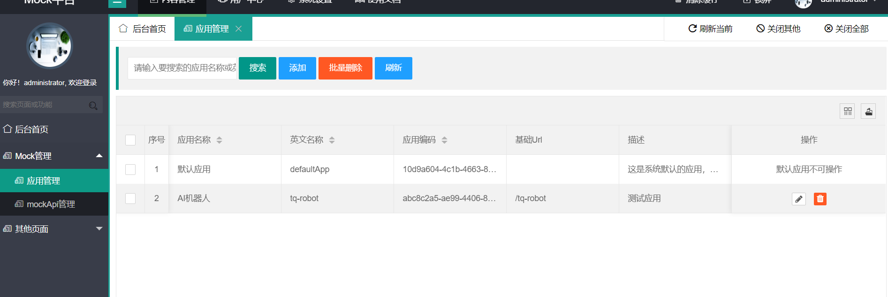

# SpringBootMockServer

MockServer平台介绍
================================
## 1.	框架介绍
主要框架：
Springboot2.1.8
Mysql(请注意Mysql版本和connector的版本对应，否则会出错)
Mybatis
Layui
Jquery
整个工程通过多模块来实现统一打包。
## 2. 部署方式
假如下载到/home/admin/mock，此时目录下有诸多工程
commons-util为公共类库
mockserver为web端
在manager_platform下运行
mvn clean package -Dmavek.test.skip=true -Dmaven.javadoc.skip=true

## 3. 设置数据库
目前引用数据库为mysql，数据库为autotest_platform_mockserver，登陆账号和密码自行设置,已经设置好允许远程连接。
如果自己要重新部署，则按照以下步骤
1.	安装mysql，或者直接找一台现成的，建一个新的库，记得设置好允许远程连接(此步骤请自行百度解决)
2.	到manager_platform\mockserver\src\main\resources下，找到application-product.properties
修改里面的数据库实例名称、登录用户名和密码
3.	后续步骤，按照后面的顺序即可
后端主要代码在mockserver工程中，
数据库初始化sql在：mockserver/src/main/resources/data/sql/data-mysql.sql
以此sql初始化即可，执行完之后，顺序执行update*.sql文件，按照日期先后执行。
如果是全新的数据库里面没有任何表结构，则可以直接执行data-mysql-full.sql里面的内容，执行此一个文件即可(未做测试，不保证成功哈)。
## 4. 关于配置文件

配置文件在以下目录中，使用的为properties文件，也可以转为相应的yml文件
mockserver/src/main/resources
激活的配置文件在application.properties 中默认是dev

## 5. 启动
日志的产生，跟运行命令的目录有关，
建议，cd到mockserver中运行

nohup java -jar target/mockserver-0.0.1.jar > log.file 2>&1 &

运行之后,不切换目录，运行
tail -200f log.file
等待日志中出现，Started **Application in 5.437 seconds (JVM running for 6.246)
如此内容，代表启动成功，默认端口为8029
稍后可以http://xxxx:8029访问

可以查看启动日志
另外每天的日志备份，和及时日志，在当前运行命令目录的上一层，也就是manager_platform下的logs中，因此运行：
cd ..
cd logs
ls
可以查看当前日志，最新的日志为springboot.log
   另外，跟logs同级的还有个my-tomcat目录，其下的logs文件夹下，存放了access日志，就是在网页中方位的url记录

## 6. 使用方式简介

目前实现了一个简易系统，主要针对Http调用的Mock，还未很详细

界面介绍如下，目前主要功能有两个，一个管理应用，一个管理Api：


### 6.1 主界面目前包含应用管理和mockApi管理

应用管理，是管理第三方应用信息的，里面有个默认的应用

### 6.2 MockApi管理

* 支持根据Api信息搜索
* 支持根据应用信息搜索
* 支持Api复制

## 7. 调用方式

假设有个第三方系统 thirdParty
主调用url为：http://thirdParty.com/thirdParty

假设你的系统调用第三方时，可能访问以下几个Url:
http://thirdParty.com/thirdParty/users/getUserList
http://thirdParty.com/thirdParty/users/getUserById
但是测试环境与这个第三方系统不通，那么你可以把你的第三方对接Url,然后调用流程改成如下方式:
### 7.1  修改主调用Url信息
先建一个应用，比如中文名[第三方系统],英文名为：[thirdParty]
那么你的主调用Url可以改成,比如http://localhost:8029/apiCallGateway/callApi/thirdParty/
那么你对另两个Url的调用就会变成:
http://localhost:8029/apiCallGateway/thirdParty/users/getUserList
http://localhost:8029/apiCallGateway/thirdParty/users/getUserById

### 7.2 新建两个MockApi

接口路径分别是: /users/getUserList /users/getUserById
再根据实际需求，填写接口参数和预期返回
这样你的系统与第三方系统的对接发出的请求，就会按照你配置的这个接口返回来返回信息，调试自己的系统就行了

### 7.3 调用方式

mock的调用方式为:

```java
@RestController("apiCallController")
@RequestMapping("/apiCallGateway")
@Api("Mock调用相关Api")
public class ApiCallControllerImpl {

	private static final Logger LOGGER = LoggerFactory
	        .getLogger(ApiCallControllerImpl.class);

	@Autowired
	private ApiCallGatewayService apiCallGatewayService;

	@RequestMapping("/callApi/{applicationEname}/{requestMappingPath}/**")
	public Object callApi(
	        @PathVariable("applicationEname") String applicationEname,
	        @PathVariable("requestMappingPath") String requestMappingPath,
	        HttpServletRequest httpServletRequest) {

```

调用url为：
http://localhost:8029/apiCallGateway/callApi/thirdParty/{你的应用ename}/{你的请求映射地址}

### 7.4 缺陷和畅想

* 将来会支持可以传递一个json，可以对一个应用下面的请求做统一处理
* 将来会根据不同的请求参数，可配置型选择接入到不同的返回值，目前针对同一个接口请求，只能修改返回值，而不能动态
* 待定...


